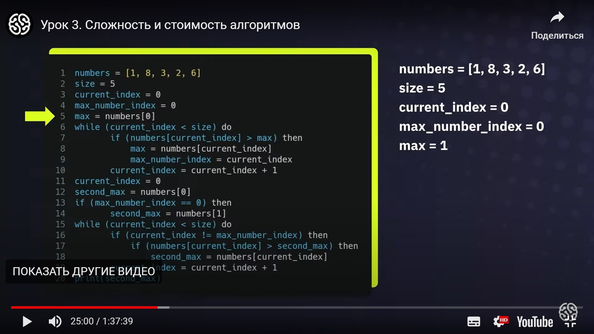

# Инструкция для работы с Markdown
## Выделение текста
## Списки
Чтобы создать ненумерованный список используйте (*) или (+) 
* First paragraph
* Second paragraph
+ Six paragraph
1. Third text
2. Fourth text
## Работа с изображениями
Чтобы вставить изобраджение необходимо:

## Ссылки
## Работа с таблицами
## Цитаты
## Заключение
**Example1** полужирный
*Example2* курсив
_12345_ курсив

